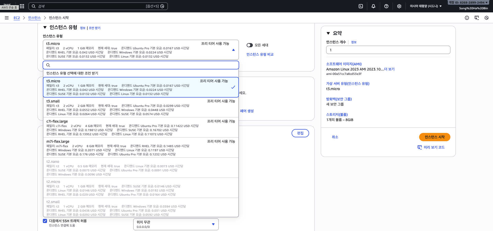
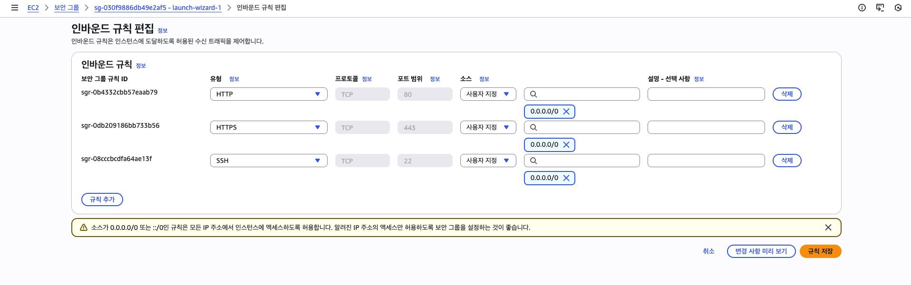
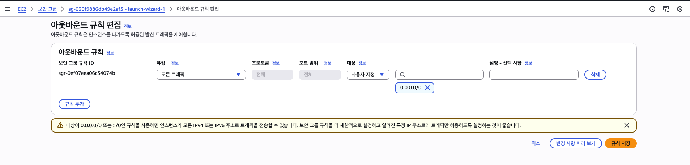
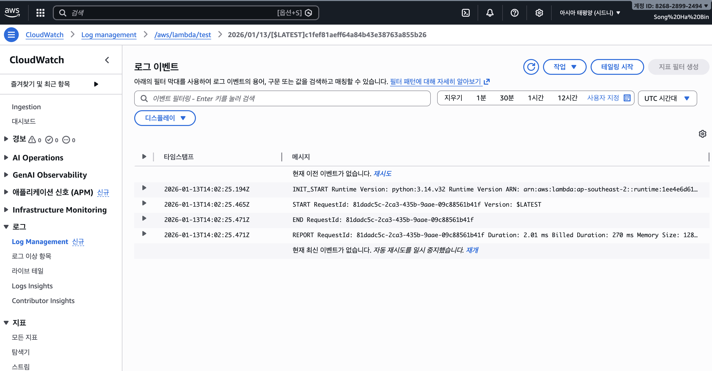

# 📚 2회차: 컴퓨팅 서비스

- **발표일**: 2026-01-18
- **발표자**: 송하빈
- **학습 범위**: 03장 ~ 03장

---

## 3. 컴퓨팅 서비스
### 1. 알아둬야 할 서버 기초 지식 
* 서버 & 클라이언트
  * 서버: 네트워크에서 데이터나 서비스를 제공하는 컴퓨터
  * 클라이언트: 그 서비스를 이용하는 프로그램
  * 클라이언트는 서버에 데이터를 요청하고 서버는 요청에 대한 응답을 반환한다.
  
* 대표적인 서버 유형
  * 웹 서버: 웹 사이트를 구성하는 필요한 데이터를 저장하고 시스템을 제어하는 프로그램을 설치한 서버
    * EC2, ECS
  * 데이터베이스 서버: 시스템이 취급하는 데이터를 통합 관리하는 데이터베이스 관리 시스템이 설치된 서버
    * RDS, DynamoDB
  * 메일 서버: SMTP 프로토콜, POP3 프로토콜을 이용해 메일 송신, 전달, 수신하는 서버
    * Amazon SES
* 서버 OS 유형
  * 운영체제: 사람이 기기의 관리와 제어를 수행하기 위한 인터페이스와 하드웨어 관리 기능, 기기에서 동작할 소프트웨어가 공통적으로 이용할 기본 기능을 구현한 소프트웨어
  * 리눅스, 윈도우 서버
* 서버 가상화
  * 가상화: 하나의 물리적 서버의 하드웨어 자원을 소프트웨어를 통해 논리적으로 분할하여 여러 개의 독립된 가상 서버로 나누어 사용하는 기술
  * 가상화를 이용하면 하나의 하드웨어에서 여러 OS를 동작시킬 수 있다.
  * 가상화를 수행하는 서버는 각 가상 서버별로 CPU나 메모리 같은 컴퓨팅 자원 규모를 결정해야한다.
  * AWS에서 가상화를 제공하는 대표적인 서비스로 Amazon EC2(Elastic Compute Cloud)이다.
  * EC2 사용자는 사용 용도에 따라 OS의 종류나 CPU, 메모리 크기를 자유롭게 선택해 인스턴스(가상 서버)를 생성할 수 있다.
### 2. EC2로 가상 서버를 손쉽게 생성
* Amazon EC2는 가상 서버 서비스
  * EC2는 가상 서버를 생성할 수 있는 서비스
  * 사용자는 AWS에서 제공하는 OS를 선택할 수 있다.
  * 온프레미스 vs EC2
    * 온프레미스는 하드웨어 준비부터 OS 설치까지 모두 사용자가 수행
    * EC2는 가상 머신 사용 준비가 완료되면 바로 OS를 사용 가능 (가상 머신을 생성할 때 OS를 함께 설치)
  * 서버의 사양(CPU, 메모리, 스토리지)을 사용자가 자유롭게 선택할 수 있다.
  * 가상 서버를 인스턴스 단위로 관리한다.
  * 인스턴스 유형과 이용 기간에 따라 이용 요금이 발생한다.
* 가상 서버 생성
  * EC2 인스턴스(가상 서버)를 생성하기 위해서는 다음 내용을 반드시 설정
    * Amazon 머신 이미지(AMI): OS와 소프트웨어가 설정된 템플릿
      * AMI 카탈로그: https://ap-southeast-2.console.aws.amazon.com/ec2/home?region=ap-southeast-2#AMICatalog:
    * 인스턴스 유형: 가상 서버의 성능을 결정
        * 
    * 배포할 네트워크: 사용자가 생성한 VPC
      * VPC: https://docs.aws.amazon.com/vpc/latest/userguide/what-is-amazon-vpc.html
    * 스토리지 용량: EBS 설정
    * 사용 권한 설정: 보안 그룹
  * SSH나 원격 데스크톱 등의 관리 시스템 기능을 이용해 인스턴스에 연결 가능
  * AWS Systems manager라는 인스턴스를 관리하는 서비스를 이용해도 인스턴스 연결 가능
* 인스턴스 유형

  * 명명 규칙: [시리즈 (패밀리)][세대][옵션].[인스턴스 크기]
  * 시리즈(Series, Instance Family): 인스턴스의 주요 용도 또는 최적화된 리소스 유형
  * 세대 (Generation): 인스턴스 하드웨어의 세대. 숫자가 높을수록 최신 하드웨어
  * 옵션 (Options): 특정 하드웨어 기능이나 프로세서 유형
  * 인스턴스 크기(Instance Size): 인스턴스 패밀리 내에서 vCPU, 메모리, 스토리지 용량 등 프로비저닝되는 리소스의 규모
    * nano -> micro -> small -> medium -> large ...
* EC2 요금제
  * 온디맨드 인스턴스: 일반적으로 사용하는 EC2 인스턴스
    * 온디맨드 요금: https://aws.amazon.com/ko/ec2/pricing/on-demand/
  * 예약 인스턴스: 요금을 선불로 지불하고 이용하는 인스턴스
    * 인스턴스 패밀리와 크기를 지정해야한다.
  * 절감형 플랜: 유연한 약정 요금
    * 인스턴스 패밀리와 크기를 지정하지 않고 할당해 구매 가능
  * 스팟 인스턴스: AWS에서 이용하지 않는 자원을 활용해 인스턴스를 생성하고 최대 90% 할인된 가격으로 사용할 수 있는 요금 모델
### 3. 가상 서버를 안전하게 외부에 공개
* 서버 외부 공개
  * EC2를 인터넷에 공개하기 위한 조건
    * EC2를 퍼블릭 서브넷에 배치
      * 서브넷(Subnet): 큰 네트워크를 더 작고 관리하기 쉬운 논리적인 부분 네트워크로 나눈 것
      * 서브넷팅(Subnetting): 서브넷 마스크를 이용해 IP주소의 네트워크 부분과 호스트 부분을 구분하여 적용해 큰 네트워크를 작은 네트워크로 나누는 행위
      * 퍼블릭 서브넷: 인터넷과 통신할 수 있는 서브넷
      * 프라이빗 서브넷: 인터넷과 직접 통신할 수 없는 서브넷
    * 퍼블릭 IP 주소를 EC2에 부여
      * 퍼블릭 IP: 인터넷과 통신할 수 있는 IP 주소
    * 보안 그룹에서 외부로부터의 접근을 허가
      * 보안 그룹: 특정 인스턴스가 특정 주소, 대역, 전체 인터넷과 통신할 수 있는 규칙을 만들어 통신을 제어
* 서버 접근 제어
  * 보안그룹을 통해 어느 곳에서 어느 곳으로 접속을 허가할지에 대한 접근 제어
  * 인바운드 규칙: 외부에서 EC2로의 통신 정의
    * 리눅스 터미널 접속을위한 SSH는 22번 포트
    * 웹 접속을 위한 HTTP는 80번 포트
  * 아웃바운드 규칙: EC2에서 외부로의 통신을 정의
    
    
### 4. 가상 서버를 안전하게 외부에 공개
* 서버 자동 추가 및 제거
  * Auto Scaling 기능을 사용하면 서버 추가 및 제거를 부하 상황에 맞게 자동으로 수행할 수 있다.
    * 스케일 아웃(Scale-out): 서버를 추가하는 것
    * 스케일 인(Scale-in): 서버를 제거하는 것
  * 대상 추적 조정 정책: 목표 사용률을 지정해 지정한 값을 유지하게끔 인스턴스 수를 자동으로 조절
  * 스케줄 스케일: 서버 자원의 부하가 아닌 사용자 접속 수와 같은 기준을 이용한 자동 추가 및 삭제를 설정하고 일정을 세워 인스턴스 수를 조절
  * 예측 스케일링: 서버 수의 수요를 예측
### 5. 서버 없이 프로그램 실행

* Lambda는 서버리스 컴퓨팅 서비스다.
  * 서버리스(Serverless): 서버가 없는 것이 아니라, 개발자가 서버 인프라를 직접 프로비저닝(할당), 관리, 유지보수할 필요 없이 애플리케이션의 코드 실행에만 집중할 수 있도록 하는 클라우드 컴퓨팅 모델
  * OS 같은 인프라를 관리할 필요가 없으므로 사용자는 프로그램 코드를 준비하고 Lambda에 업로드만 하면 된다.
  * Lambda가 지원하는 언어
    * Node.js, Java, Python, PowerShell, Ruby, C#, Go ...
* Lambda 장점
  * 보안
    * AWS에서 OS와 미들웨어 등의 기반 시스템을 모두 관리하며, 장애와 보안 패치도 진행
  * 비용
    * EC2는 사용하지 않아도 기동하고 있는 시간만큼 요금이 발생하지만, Lambda에서는 코드가 실행될 때만 요금이 부과
  * 가용성
    * Lambda는 복수의 가용 영역(AZ)에서 실행
  * 확장성
    * 동시에 다수의 처리를 해야하는 경우 자동으로 AWS가 관리하는 처리용 인스턴스가 시작되면서 확장
* EC2 장점
  * 인스턴스 유형, OS, 네트워크 등을 자유롭게 설정 가능
  * 대량의 트래픽이나 접속을 상시 처리하는 경우 EC2쪽이 저렴해질 수 있다.
* 함수 생성 및 실행: https://ap-southeast-2.console.aws.amazon.com/lambda/home?region=ap-southeast-2#/functions
### 6. 서버리스 활용법 이해
* Lambda 함수는 다른 AWS 서비스와 연계해 사용자 접속이나 데이터 연동과 같은 처리를 자동으로 수행할 수 있다. 
  * 사용자 요청에 따라 Lambda 함수 실행
  
    * Amazon API Gateway 서비스와 Lambda를 결합해 사용자의 HTTP 요청을 Lambda함수로 처리할 수 있다.
    * API Gateway도 서버리스 서비스이므로 사용자는 서버를 구축하지 않고도 웹 응용프로그램을 만들 수 있다.
      * Amazon API Gateway: EC2에서 실행되는 워크 로드, AWS Lambda에서 실행되는 코드, 모든 웹 어플리케이션 또는 실시간 통신 어플리케이션과 같은 백엔드 서비스의 데이터, 비즈니스 로직 및 기능을 연결하고 액세스
      * https://ap-southeast-2.console.aws.amazon.com/apigateway/main/welcome?region=ap-southeast-2
  * S3에 데이터를 저장할 때 자동 처리
    * S3에 데이터가 저장되면 저장된 데이터를 Lambda로 자동 처리할 수 있다.
      * 가이드: https://docs.aws.amazon.com/ko_kr/lambda/latest/dg/with-s3-example.html
  * 주기적으로 Lambda 함수 실행
    * 주기적으로 정해진 시간에 어떤 처리를 하고 싶다면 Amazon EventBridge와 연계해 구현 가능
* AWS Lambda 추가 설정 및 모니터링
  * Lambda의 실행 환경은 일반적으로 AWS 측에서 관리하므로 사용자는 특별히 서버 설정에 관여하지 않아도 되지만, 다음 3가지 설정은 사용자가 변경할 수 있다.
    * 메모리 용량: 함수 실행시 사용할 수 있는 메모리 용량
    * 타임아웃 시간: 함수가 실행되는 최대 시간. 이 시간이 지나도 실행되고 있는 경우 정지된다.
    * 환경 변수: 함수에 사용하는 외부 변수
  * 처음 Lambda 함수를 만들면 다른 서비스에 대한 조작 권한을 따로 부여해야 한다.
    * Lambda 함수에 IAM 역할 형식으로 권한을 부여해야 한다.
    * S3 버킷에 데이터를 저장하는 처리를 해야하는 경우 S3의 PutObject 권한을 가지는 IAM 역할을 만들어 Lambda함수에 설정해야한다.
      * IAM S3 PutObject 권한 정책
        ```json
        {
        "Version": "2012-10-17",
        "Statement": [
            {
            "Effect": "Allow",
            "Action": [
                "s3:PutObject"
            ],
            "Resource": "arn:aws:s3:::my-example-bucket/*"
            }
        ]
        }
        ```
     * IAM 역할을 지정하지 않으면 Lambda 기본 IAM 역할이 자동으로 만들어지고 설정된다. 자동으로 생성된 IAM 역할에는 Amazon CloudWatch라는 감시 서비스로 로그를 보낼 수 있는 권한만 부여된다.
  * Lambda 함수를 만들어 배포하면 AWS 모니터링 서비스인 CloudWatch에 다음과 같은 정보가 자동으로 전송되므로 사용자는 Lambda 실행 상황을 확인할 수 있다.
    * 실행 횟수
    * 실행 시간(최소/최대/평균)
    * 오류 수와 실행 성공률
  * Metric 뿐만 아니라 함수가 출력하는 로그도 CloudWatch 로그로 자동 전송된다.
    
### 7. 컨테이너의 구조와 특징 이해
* 컨테이너란
  * 가상 서버와 컨테이너 비교
  
    * 가상서버
      * 1대의 물리 서버에서 복수의 가상 서버가 동작한다.
      * 가상 하드웨어 위에 OS, 미들웨어가 설치돼 그 위에서 프로세스(응용 프로그램)가 실행된다.
      * 하이퍼바이저로 가상화 기술을 구현한다.
        * 하나의 물리적 컴퓨터에서 여러 개의 독립적인 가상머신을 생성하고 실행할 수 있도록 하는 소프트웨어 또는 펌웨어 계층
    * 컨테이너
      * 1개의 물리 서버에서 여러 컨테이너가 동작한다.
      * 서버의 OS와 물리 자원은 각 컨테이너가 공동으로 이용한다.
      * 각 컨테이너는 네트워크가 분리돼 있지만 외부 네트워크와의 통신이나 컨테이너 간 통신을 할 때 컨테이너 런타임을 통해 이루어진다.
      * 컨테이너에서 프로세스가 실행된다.
      * 컨테이너 런타임으로는 Docker, containerd가 있다.
        * 컨테이너 이미지를 실제 컨테이너로 만들고 실행, 관리하는 소프트웨어 엔진
  * 컨테이너 이미지: 컨테이너가 어떤 응용 프로그램, OS를 기반으로 시작하는지 정의한 베이스 파일
  * 컨테이너는 컨테이너 이미지를 바탕으로 실행된다.
  * 이미지를 기반으로 여러 컨테이너를 실행할 수 있다.
* 가볍고 빠른 컨테이너
  * 컨테이너는 가상화에비해 가볍고 빠르다
  * 가상화
    * 가상 서버를 기동하면 OS, 미들웨어, 응용 프로그램 등이 필요하다. 가상 서버 이미지에는 이러한 파일이 모두 포함된다 (GB 단위 크기).
    * 가상 서버는 일반 서버와 마찬가지로 운영체제가 시작된 후 미들웨어, 응용 프로그램이 실행되는 형태다. 그래서 속도가 컨테이너보다 느리다.
  * 컨테이너
    * 컨테이너는 응용 프로그램 프로세스만 포함된다. 컨테이너 이미지도 기본적으로 응용 프로그램을 실행하기 위한 의존 패키지만 포함되므로 가상 서버에 비해 가볍다 (MB 단위 크기).
    * 컨테이너는 직접 응용 프로그램을 실행하기 때문에 전체적으로 응용 프로그램이 실행될 때까지의 속도가 빠르다. OS에 대한 오버헤드가 없는 만큼 가상 서버보다 처리 속도가 빠르다.
      * 빌드, 배포에 드는 시간이 단축되므로 효율적인 개발이 가능하다.
* 배포의 용이성
  * 컨테이너 이미지는 한번 생성하면 그 이미지를 다른 서버에서 바로 사용할 수 있다.
  * 서로 다른 환경에서도 이미지 안의 내용은 바뀌지 않으므로 개발할 때 설정해둔 내용이나 사용한 라이브러리를 그대로 사용할 수 있다는 장점이 있다.
    * 온프레미스 또는 EC2와 같은 서버에서라면 개발 환경과 사용 환경의 의존성 환경을 맞춰야 하며, 개발자의 PC에도 동일한 라이브러리를 설치해 동작을 확인해야하 하지만 컨테이너에서는 불필요하다.
  * 컨테이너 이미지는 이미지 레포지토리를 이용해 이미지를 업로드하거나 내려받을 수 있다.
  * 컨테이너는 기본적으로 '완성된 이미지'이므로 컨테이너가 종료되면 안에 저장되 내용이 사라진다.
    * 컨테이너가 실행될 호스트의 디렉터리를 마운트해서 작업 내용을 저장하는 등의 처리를 해야한다.
* 컨테이너 오케스트레이션
  * 수많은 컨테이너를 자동화된 방식으로 배포, 스케일링(확장/축소), 관리하는 기술
  * 자동화된 배포 및 확장: 필요에 따라 컨테이너 수를 자동으로 늘리거나 줄여 리소스 효율성을 높인다.
  * 클러스터링: 여러 머신(노드)을 하나의 논리적 단위로 묶어 컨테이너를 관리한다.
  * 로드 밸런싱: 들어오는 트래픽을 여러 컨테이너에 분산시켜 안정적인 서비스를 제공한다.
  * 장애 복구: 실패한 컨테이너를 자동으로 재시작하거나 교체하여 가용성을 유지한다.
  * 상태 모니터링 및 관리: 컨테이너의 상태를 지속적으로 확인하고 관리한다.
  * 네트워킹: 컨테이너 간 통신 및 외부 서비스와의 연결을 관리한다.
### 8. ECS로 누리는 컨테이너의 장점
* AWS의 컨테이너 오케스트레이션 서비스
  * AWS에서 컨테이너 시스템을 구축하는 경우 ECS(Elastic Container Service)와 EKS(Elastic Kubernetes Service)를 선택할 수 있다.
    * 오케스트레이션 기능을 ECS는 AWS가, EKS는 쿠버네티스가 담당한다.
  * ECS
    
    * AWS의 관리형 오케스트레이션 서비스
    * ECR(Elastic Container Registry)라는 컨테이너 이미지 레지스트리 서비스를 통해, 사용자 정의 된 컨테이너 이미지를 AWS에서 관리할 수 있고 ECS에도 쉽게 배포할 수 있다.
    * 태스크: ECS에서 컨테이너는 태스크라는 개념으로 정의되며, 컨테이너 이미지, 실행 수 같은 태스크 설정을 정의
    * 노드: 컨테이너를 실행하는 서버. ECS의 경우에 EC2 인스턴스 또는 Fargate를 선택할 수 있다.
    * ALB(Application Load Balancer)와 연결된 태스크의 집합체를 서비스로 정의한다.
* EC2와 Fargate
  * ECS를 이용해 컨테이너를 기동할 때 EC2와 AWS Fargate 두 가지 중 하나를 선택할 수 있다.
  * EC2
    * EC2 인스턴스 내에서 실행되는 컨테이너 런타임에서 컨테이너를 실행하는 타입이다.
    * EC2의 사용자 책임 범위는 OS, 미들웨어, 컨테이너에서 실행되는 응용 프로그램
    * CPU/메모리를 늘리고 싶다면 인스턴스 타입을 적절한 것으로 변경한다.
    * 스토리지를 늘리고 싶으면 EBS의 크기를 확장하면 된다.
  * Fargate
    * AWS에서 관리하는 서버에서 컨테이너를 실행한다.
    * 컨테이너 런타임, OS 버전업과 같은 서버 관리를 AWS에서 하므로 사용자는 컨테이너 이미지만 관리하면 된다.
    * 서버의 컨테이너 런타임, OS와 같은 버전은 플랫폼 버전(PV)으로 관리된다.
    * CPU와 메모리를 직접 할당할 수 있지만, 지정한 CPU 값에 따라 할당할 수 있는 메모리 크기가 정해져 있다.
    * 스토리지는 사전에 Fargate 태스크 스토리지로 태스크 실행시 할당되며 할당량은 PV에 따라 다르다.
    * EC2는 컨테이너를 실행하면 정기적인 유지보수가 필요하지만 Fargate에서는 AWS에서 담당하므로, 응용 프로그램 개발에 집중할 수 있다.
* EKS
  * 자체 쿠버네티스 인프라 설치 및 운영할 필요 없이 AWS에서 Kubernetes를 쉽게 사용할 수 있도록 해주는 관리형 서비스
    * Kubernetes: 컨테이너화된 애플리케이션의 배포, 확장, 관리를 자동화하는 오픈소스 컨테이너 오케스트레이션 플랫폼
  * https://aws.amazon.com/ko/eks/
### 9. 서버 지식 없이 사용할 수 있는 대표적인 서비스
* 서버 지식 없이 사용할 수 있는 대표적인 서비스 5개
  * AWS Lightsail
    
    * 자주 사용되는 구성의 가상 서버를 쉽고 빠르게 구축하기 위한 서비스
    * 여러 인스턴스를 만들면 자동으로 로드 밸런싱을 해주거나 SSL/TLS 인증서를 통한 통신 암호화도 대응하는 등 기본적인 기능은 제대로 준비됨
    * 데이터베이스나 컨테이너 환경 생성에 대응하는 것 외에도 VPC를 통해 다른 AWS 서비스와 연동할 수 있으므로 간단한 구성의 시스템 구축 가능
    * EC2에서 구축할 때와 같이 미들웨어 버전을 고려해 설치하거나 ELB를 이용해 유연한 부하 분산을 설정하는 등의 자유도는 없다.
    * Lightsail에서 EC2로 마이그레이션하는 기능 존재
  * AWS Elastic Beanstalk
    
    * 주요 언어나 환경에서 개발된 응용 프로그램을 배포하기 위한 실행 환경을 자동으로 만들어주는 서비스다
    * ~~플랫폼(Java, .NET, PHP, Python, Ruby, Go, Docker)을 지정해 응용 프로그램 코드를 업로드하면 EC2, RDS, S3와 같은 AWS 자원이 자동으로 구축되고 응용 프로그램이 배포된다.~~
      * Elastic Beanstalk는 애플리케이션 코드(빌드된 파일, jar 등)을 업로드하면 EC2 중심의 실행 환경을 자동으로 구성해 배포해주지만, RDS, S3 같은 데이터 자원은 기본적으로 자동 생성하지 않고 선택적으로 연동한다.
    * 사용자가 스스로 구축할 수 있는 시스템을 서버 지식 없이도 구축할 수 있다.
    * 여러가지 배포 방식 지원
      * All at once 방식: 모든 인스턴스의 응용 프로그램을 한 번에 교체하는 방식
         * 교체 중에는 서비스가 중지된다.
      * 롤링 방식: 각 인스턴의 응용 프로그램을 순서대로 교체하는 방식.
        * 교체중인 인스턴스만 서비스가 정지되므로 전체적으로는 서비스를 계속 제공할 수 있다.
      * 이뮤터블(불변) 방식: 새로운 응용 프로그램을 배포한 인스턴스를 만든 뒤 기존 인스턴스를 삭제하는 방식
        * 서비스를 계속 제공하면서 문제가 발생하면 쉽게 배포를 중지할 수 있다.
  * AWS App Runner
    
    * 컨테이너화된 응용 프로그램을 손쉽게 배포하는 서비스
    * 컨테이너 이미지를 지정하고 서비스 포트나 Auto Scaling과 같은 몇 가지 설정만으로 컨테이너를 Fargate에 배포할 수 있다.
  * AWS Batch
    
    * 지정된 프로그램을 EC2나 Fargate에서 실행하는 서비스
    * 실행 프로그램의 순서 관리나 다수 프로그램의 병렬 구동과 같은 복잡한 제어에 특화된 서비스
  * AWS Outposts
    
    * 사용자가 온프레미스 환경에서 AWS와 같은 서비스를 실행할 수 있도록 AWS가 물리 서버를 대여
    * AWS의 새로운 가용 영역으로 사용 가능
## ❓ 질의응답 및 토론
- **Q**: 
- **A**:
