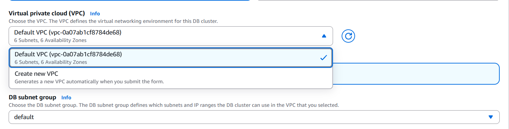

# RDS 인스턴스 생성 시 서브넷 / AZ / DB Subnet Group 정리

## 1. RDS 인스턴스를 생성하려면 최소 두 개의 서브넷이 필요하다 — 왜?

RDS는 단순히 서버 하나를 띄우는 서비스가 아니라  
**AWS가 운영·유지보수·재배치를 책임지는 관리형 서비스**다.

이를 위해 AWS는 다음 작업을 수행해야 한다.
- 호스트 장애 대응
- 유지보수(패치, 하드웨어 교체)
- 내부 재배치 또는 재생성

이 작업들을 하려면  
**DB를 다른 위치로 옮길 수 있는 “자리”가 최소 1개 더 필요**하다.

그래서:
- 서브넷 1개 → 이동 불가 ❌
- 서브넷 2개 이상 → 이동 가능 ⭕️

👉 **즉, 자동 복구를 위한 것이 아니라  
RDS를 ‘관리형 서비스’로 운영하기 위한 최소 조건이다.**

---

## 2. 서브넷은 왜 리전 내 서로 다른 AZ여야 하나?

- 하나의 AZ는 **동시에 장애가 날 수 있는 단위**
- 같은 AZ에 서브넷을 여러 개 만들어도
  - 장애 도메인은 동일
  - 의미 없음

그래서 AWS는 아래와 같이 강제함

> **RDS에서 사용하는 서브넷은  
> 반드시 서로 다른 AZ에 속해야 한다**

---

## 3. 그런데 RDS 생성 화면에서는 서브넷을 안 고르는데?

**RDS 생성 시 서브넷을 직접 고르지 않는다.**

대신 다음을 선택한다.

---

## 4. DB Subnet Group이란?

**DB Subnet Group**은  
> **RDS가 사용할 수 있도록 허용된 서브넷들의 묶음**이다.

특징:
- RDS는 VPC 전체를 자유롭게 쓰지 않는다
- **이 그룹에 포함된 서브넷 안에서만**
  - DB를 생성
  - 이동
  - 유지보수한다
- 반드시
  - **서로 다른 AZ의 서브넷 ≥ 2개** 포함
  - (AWS가 강제)

---

## 5. 콘솔에서 `default`만 보이는 이유

Default VPC를 사용하는 경우:
- AZ마다 서브넷이 이미 자동 생성돼 있고
- AWS가 미리 만들어 둔
  - **default DB Subnet Group**이 존재
  - 그 안에 **여러 AZ의 서브넷**이 들어 있음

그래서:
- 사용자는
  - 서브넷을 직접 고르지 않고
  - `default` Subnet Group만 선택하면 됨
- 최소 2개 서브넷 / 서로 다른 AZ 조건은
  - **이미 충족된 상태**

---

## 6. 전체 흐름 요약

### 개념 흐름
1. RDS는 AZ 단위로 배치·이동되는 관리형 DB
2. 이를 위해 서로 다른 AZ의 서브넷 ≥ 2개 필요
3. 그 서브넷들을 묶은 개념이 DB Subnet Group

### 실무 / 콘솔 흐름
1. VPC 선택
2. DB Subnet Group 선택 (`default` 또는 직접 생성)
3. RDS 생성
   - 서브넷 직접 선택 ❌
   - Subnet Group으로 간접 선택 ⭕️

---

## 한 줄 요약

**RDS에서 “최소 두 개의 서브넷 + 서로 다른 AZ”라는 말은  
실제로는 “서로 다른 AZ의 서브넷이 2개 이상 포함된  
DB Subnet Group을 선택해야 한다”는 의미다.**

